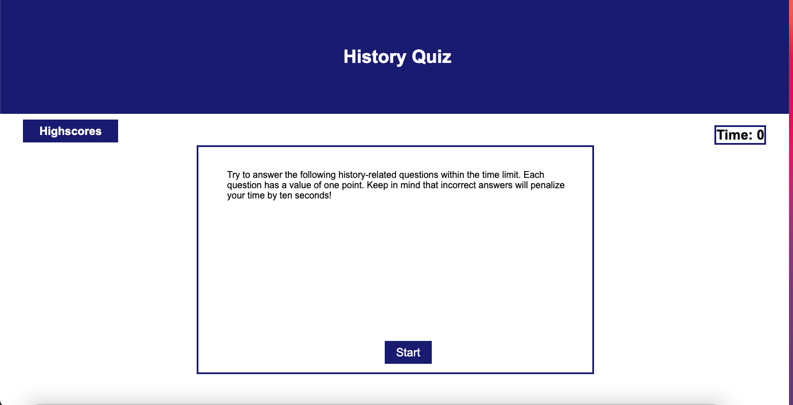
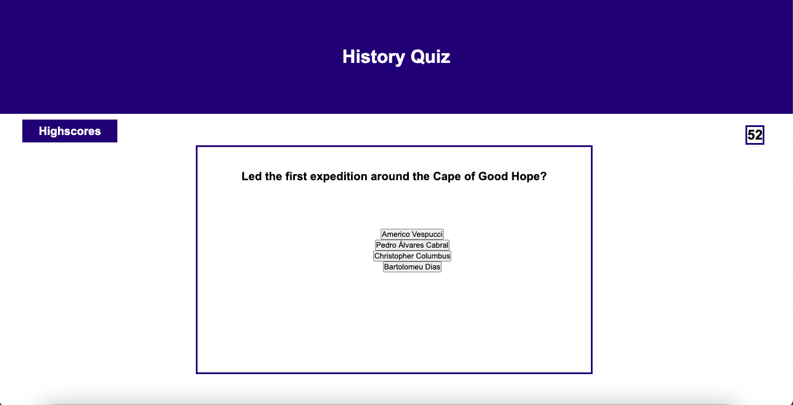
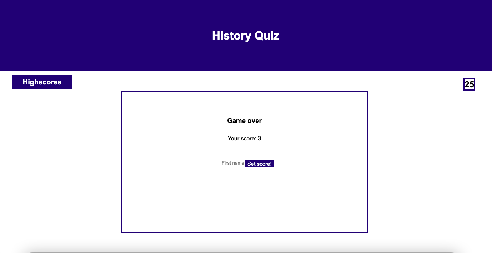

# Code-Quiz

## Description
Want to put your history knowledage to the test? Challenge your self with our random universal history questions.

## Installation
This project has been deployed to GitHub. https://github.com/Eduadomtz/Code-Quiz

To get this project up and running, you can follow the deployment link. https://eduadomtz.github.io/Code-Quiz/

## Usage
Press the start button

A question and a serious of options will prompt. Choose the answer you think is the right one. 

Once you've finished the test you'll see your score. 

Then type your name an set your score!

## Features
- HTML
- JS
- CSS